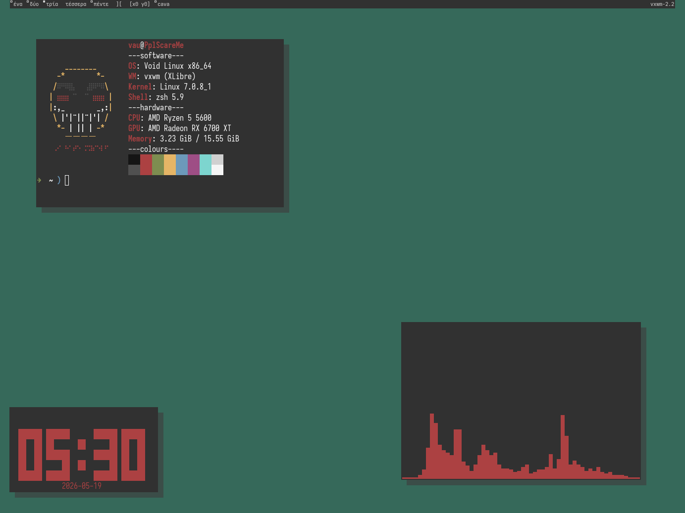

# dotfiles

### stuff youll need to install for this:
 

vxwm, urxvt (vrxt-unicode and urxvt-perls), vesktop, polybar, dunst, slock, flameshot, helium, fastfetch, picom, dmenu, dolphin and kate
 

### install:
 
- helium browser - download the folder, go to "manage extensions", turn developer mode on, and add the folder with "load unpacked".

- bonjourr homepage - install the bonjourr extension in your browser, go to its settings and import the file.

- vesktop - download the file, open your themes folder, and drop it there.

- urxvt - download the file, move it to your user directory, and type into the terminal "xrdb ~/.Xresources".

- vxwm - download the files, replace the default ones in ~/vxwm, "make" and "sudo make clean install".

- dmenu scripts - move it to your .local/bin/ directory.

- polybar - if you want to use polybar, youll need to turn off the vxwm bar in config.h and add polybar to the autostart in it aswell.
 

as for the .config files, yk what to do with them. (drop them into your .config directory)  
 

#### cli eyecandy/tools that i like:

lavat, btop, cava, asciiquarium, neovim, yazi, tty-clock, and fastfetch.  
 

### more:   
use the "kvantum" theme in qt apps like dolphin and kate. (i was lazy)

install steam millennium and use the "classic steam library" theme.

install strawberry player and set the tabbar color to grey.

make your own themes for stuff you use. Main colors that were used are #313131 and #d1d1d1  
 

picom config was COMPLETELY made by wh1tepearl, PLEASE dont crucify me PLEASE  
